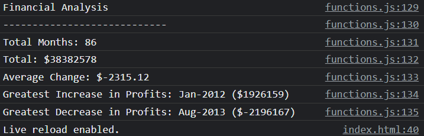

# Console Finances

## Description 

This application presents a real-world situation in which my JavaScript skills will come in handy. I am tasked with creating code for analyzing the financial records of a company. I have been provided with a financial dataset in the "functions.js" file.


## Table of Contents

* [Instructions](#Instructions)
* [Mock-Up](#Mock-Up)
* [Technical Acceptance Criteria: 40%](#Technical-Acceptance-Criteria-40)
* [Deployment: 32%](#Deployment-32)
* [Application Quality: 15%](#Application-Quality-15)
* [Repository Quality: 13%](#Repository-Quality-13)
* [Badges🏆](#Badges)

## Instructions

I have been given a dataset composed of arrays with two fields: Date and Profit/Losses.
My task is to write JavaScript code that analyzes the records to calculate each of the following:

- [x] The total number of months included in the dataset.  
- [x] The net total amount of Profit/Losses over the entire period.  
- [x] The average of the changes in Profit/Losses over the entire period.  
  - [x] I will need to track what the total change in profits is from month to month and then find the average.  
  - [x] (Total/Number of months)  
- [x] The greatest increase in profits (date and amount) over the entire period.  
- [x] The greatest decrease in losses (date and amount) over the entire period.  


## Mock-Up

When I open my code in the browser my resulting analysis should look similar to the following:

```
Financial Analysis
----------------------------
Total Months: 25
Total: $2561231
Average  Change: $-2315.12
Greatest Increase in Profits: Feb-2012 ($1926159)
Greatest Decrease in Profits: Sep-2013 ($-2196167)
```

The following image shows the web application's appearance and functionality:



---
## Technical Acceptance Criteria: ```40%```

- Satisfies all of the above acceptance criteria.

## Deployment: ```32%```

- Application deployed at live URL.

- Application loads with no errors.

- Application GitHub URL submitted.

- GitHub repository that contains application code.

## Repository Quality: ```23%```

- Repository has a unique name.

- Repository follows best practices for file structure and naming conventions.

- Repository follows best practices for class/id naming conventions, indentation, quality comments, etc.

- Repository contains multiple descriptive commit messages.

- Repository contains quality README file with description, screenshot, and link to deployed application.

## Application Quality: ```5%```

- Application resembles the mock-up functionality provided in the Challenge instructions.

## Badges🏆


---

Elvis Stiglic © 2023
